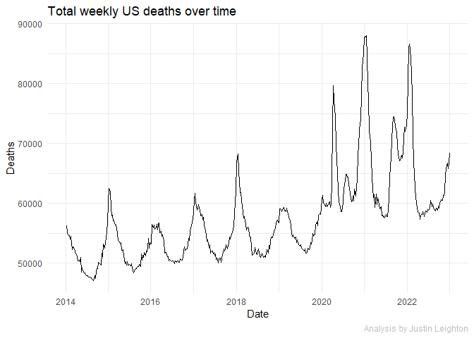
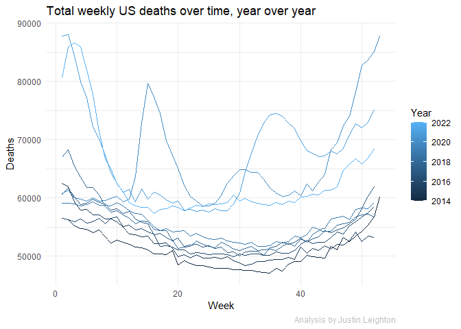
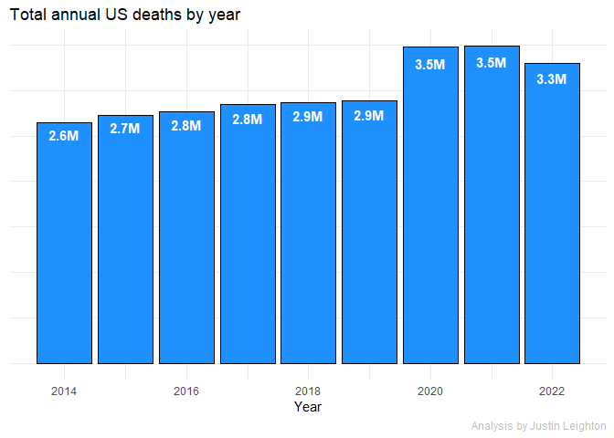
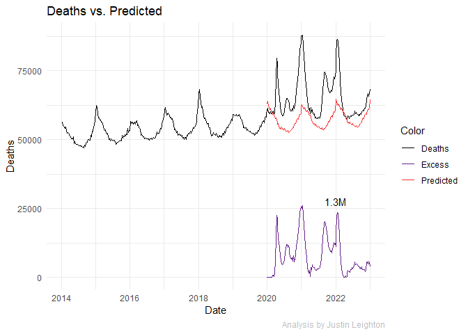
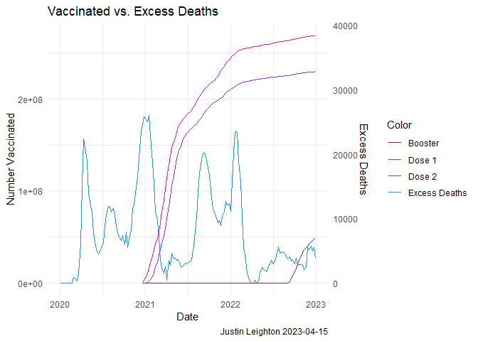

# COVID-19 excess deaths analysis


## Import data


```
##     State       Date Year Week Deaths
## 1 Alabama 2014-01-11 2014    2    872
## 2 Alabama 2014-01-18 2014    3   1044
## 3 Alabama 2014-01-25 2014    4   1022
## 4 Alabama 2014-02-01 2014    5   1040
## 5 Alabama 2014-02-08 2014    6    992
## 6 Alabama 2014-02-15 2014    7    942
```

## Analysis

This data comes from the CDC and reports on total deaths from all causes by week and state. The format changes a few times, requiring several separate data pulls, and some data wrangling to append all records together.

The goal of this analysis is to see if we can parse out "excess deaths" and compare to the reported COVID-19 deaths in order to put to bed a conspiracy related to COVID deaths being exaggerated. 


```r
df %>%
  group_by(Date) %>%
  summarise(Deaths = sum(Deaths)) %>%
  ggplot(aes(x = Date, y = Deaths)) +
  geom_line() +
  theme(plot.caption=element_text(color='grey')) +
  labs(title = 'Total weekly US deaths over time',
       caption = 'Analysis by Justin Leighton')
```

<!-- -->

The cyclical nature of this chart shows the annual flu season in the US, which is most pronounced at the start of the year. Some flu seasons are worse than others. Deaths also have a slight increasing trend which is presumably related to population growth. 2020 shows the start of some fairly extreme peaks.


```r
df %>%
  group_by(Week, Year) %>%
  summarise(Deaths = sum(Deaths)) %>%
  ggplot(aes(x = Week, y = Deaths, group = Year, col = Year)) +
  geom_line() +
  theme(plot.caption=element_text(color='grey')) +
  labs(title = 'Total weekly US deaths over time, year over year',
       caption = 'Analysis by Justin Leighton')
```

<!-- -->

The year-over-year plot shows the breakdown of the cyclical nature of deaths in 2020 and the years following. Clearly COVID was not just a bad flu season.


```r
# Plot deaths by year
df %>%
  group_by(Year) %>%
  summarise(Deaths = sum(Deaths)) %>%
  mutate(label = paste0(round(Deaths / 1e6,1),'M')) %>%
  ggplot(aes(x = Year, y = Deaths)) +
  geom_col(fill = "dodgerblue", col = "black") + 
  geom_text(aes(label=label), col='white', fontface='bold', position=position_stack(vjust=0.95)) +
  theme(axis.title.y=element_blank(),
        axis.text.y=element_blank(),
        axis.ticks.y=element_blank(),
        plot.caption=element_text(color='grey')) +
  scale_x_continuous(breaks=pretty_breaks()) +
  labs(title = 'Total annual US deaths by year',
       caption = 'Analysis by Justin Leighton')
```

<!-- -->

The annual view helps to smooth out the seasonal trend. The increase in 2020 onwards appears distinctly greater than the usual annual increase, which is at most 100k+ per year, and the gap between 2019 and 2022 is around 600k+. In order to properly quantify this we need to build a model to predict expected 2020+ deaths in the absence of COVID.


```r
# Auto Arima
model_ts <- df %>%
  filter(Year < 2020) %>%
  group_by(Date) %>%
  summarise(Deaths = sum(Deaths)) %>%
  arrange(Date) %>%
  select(Deaths) %>%
  ts(start = decimal_date(ymd(min(df$Date))), frequency = 367.25/7) %>%
  auto.arima(trace=TRUE, test = "kpss", approximation = FALSE)
```

```
## Warning: The time series frequency has been rounded to support seasonal
## differencing.
```

```
## 
##  ARIMA(2,0,2)(1,1,1)[52] with drift         : Inf
##  ARIMA(0,0,0)(0,1,0)[52] with drift         : 4703.433
##  ARIMA(1,0,0)(1,1,0)[52] with drift         : 4246.712
##  ARIMA(0,0,1)(0,1,1)[52] with drift         : Inf
##  ARIMA(0,0,0)(0,1,0)[52]                    : 4748.562
##  ARIMA(1,0,0)(0,1,0)[52] with drift         : 4314.653
##  ARIMA(1,0,0)(2,1,0)[52] with drift         : Inf
##  ARIMA(1,0,0)(1,1,1)[52] with drift         : Inf
##  ARIMA(1,0,0)(0,1,1)[52] with drift         : Inf
##  ARIMA(1,0,0)(2,1,1)[52] with drift         : Inf
##  ARIMA(0,0,0)(1,1,0)[52] with drift         : Inf
##  ARIMA(2,0,0)(1,1,0)[52] with drift         : 4248.047
##  ARIMA(1,0,1)(1,1,0)[52] with drift         : 4248.273
##  ARIMA(0,0,1)(1,1,0)[52] with drift         : 4447.914
##  ARIMA(2,0,1)(1,1,0)[52] with drift         : 4246.463
##  ARIMA(2,0,1)(0,1,0)[52] with drift         : 4313.015
##  ARIMA(2,0,1)(2,1,0)[52.46429] with drift         : Inf
##  ARIMA(2,0,1)(1,1,1)[52] with drift         : Inf
##  ARIMA(2,0,1)(0,1,1)[52] with drift         : Inf
##  ARIMA(2,0,1)(2,1,1)[52.46429] with drift         : Inf
##  ARIMA(3,0,1)(1,1,0)[52] with drift         : 4242.461
##  ARIMA(3,0,1)(0,1,0)[52] with drift         : 4304.453
##  ARIMA(3,0,1)(2,1,0)[52.46429] with drift         : Inf
##  ARIMA(3,0,1)(1,1,1)[52] with drift         : Inf
##  ARIMA(3,0,1)(0,1,1)[52] with drift         : Inf
##  ARIMA(3,0,1)(2,1,1)[52.46429] with drift         : Inf
##  ARIMA(3,0,0)(1,1,0)[52] with drift         : 4240.443
##  ARIMA(3,0,0)(0,1,0)[52] with drift         : 4302.638
##  ARIMA(3,0,0)(2,1,0)[52.46429] with drift         : Inf
##  ARIMA(3,0,0)(1,1,1)[52] with drift         : Inf
##  ARIMA(3,0,0)(0,1,1)[52] with drift         : Inf
##  ARIMA(3,0,0)(2,1,1)[52.46429] with drift         : Inf
##  ARIMA(4,0,0)(1,1,0)[52] with drift         : 4242.476
##  ARIMA(4,0,1)(1,1,0)[52] with drift         : Inf
##  ARIMA(3,0,0)(1,1,0)[52]                    : 4246.358
## 
##  Best model: ARIMA(3,0,0)(1,1,0)[52] with drift
```

## Plot fitted and extrapolate excess deaths


```r
# Predict Excess Deaths
pred <- forecast(model_ts, length(unique(filter(df, Year >= 2020)$Date))) %>%
  as.data.frame() %>% .[,1] %>% `length<-`(length(unique(df$Date)))
df_fit <- df %>%
  group_by(Date, Year, Week) %>%
  summarise(Deaths = sum(Deaths)) %>%
  as.data.frame() %>%
  mutate(flag = Year >= 2020) %>%
  arrange(-flag, Year, Week) %>%
  cbind(Pred = pred) %>%
  select(!flag) %>%
  `colnames<-`(c("Date", "Year", "Week", "Deaths", "Pred")) %>%
  mutate(Excess = as.integer(Deaths - Pred),
         Excess = ifelse(Excess < 0, 0, Excess))

# Quantify total excess deaths
TotalExcess <- paste0(round(sum(df_fit$Excess, na.rm=TRUE)/1e6,1),'M')

# Plot deaths over time with predicted values
df_fit %>%
  ggplot(aes(x = Date, y = Deaths, col="Deaths")) +
  geom_line(na.rm=TRUE) +
  geom_line(aes(y = Pred, col="Predicted"), na.rm=TRUE) +
  geom_line(aes(y = (Deaths - Pred) * (Deaths > Pred), col="Excess"), na.rm=TRUE) +
  scale_color_manual(name = "Color", values = c("Deaths" = "black", 
                                                "Predicted" = "firebrick1",
                                                "Excess" = "darkorchid4")) +
  annotate("text", label=TotalExcess, x=as.Date('2022-01-01'), y=27500) +
  theme(plot.caption=element_text(color='grey')) +
  labs(title="Deaths vs. Predicted",
       caption = "Analysis by Justin Leighton") +
  geom_blank()
```

<!-- -->

Now that we can extrapolate a quantifiable figure for excess deaths, 1.3M. As of the end of 2022, the CDC was reporting roughly 1.1M total deaths due to COVID. Contrary to the conspiracy theory, it appears as though the CDC has slightly under counted. I suspect that this is due to the still not-well-understood long-term effects of the disease.

Finally, I wanted to overlay vaccination data to see the effects of the vaccine. Note that booster figures were not reliably tracked by the CDC until well into 2022. The true booster rate is higher than portrayed, and starts a bit sooner.


```r
# Import VAX data - https://covid.cdc.gov/covid-data-tracker/#vaccination-trends
df_vax <- read.csv("./trends_in_number_of_covid19_vaccinations_in_the_us.csv") %>% 
  `colnames<-`(c("Date", "Year", "Week", "Dose1", "Dose2", "Booster")) %>%
  mutate(Date = as.Date(Date, format="%m/%d/%Y")) %>%
  group_by(Year, Week) %>%
  mutate(Date = max(Date)) %>%
  group_by(Date, Week, Year) %>%
  summarise(Dose1 = sum(Dose1),
            Dose2 = sum(Dose2),
            Booster = sum(Booster)) %>%
  ungroup() %>% arrange(Date) %>% as.data.frame() %>%
  mutate(Dose1_cs = cumsum(Dose1),
         Dose2_cs = cumsum(Dose2),
         Booster_cs = cumsum(Booster))

# Plot Excess vs. Vaccinations
scale <- 7000
df_fit %>%
  filter(Year >= 2020) %>%
  left_join(df_vax, on=c("Week", "Year")) %>%
  ggplot(aes(x = Date)) +
  geom_line(aes(y = Excess * scale, col = "Excess Deaths"), na.rm=TRUE) + 
  geom_line(aes(y = Dose1_cs, col="Dose 1"), na.rm=TRUE) + 
  geom_line(aes(y = Dose2_cs, col="Dose 2"), na.rm=TRUE) +
  geom_line(aes(y = Booster_cs, col="Booster"), na.rm=TRUE) +
  scale_y_continuous(sec.axis = sec_axis(~./scale, name="Excess Deaths")) +
  scale_color_manual(name = "Color", values = c("Excess Deaths" = "dodgerblue", 
                                                "Dose 1" = "deeppink",
                                                "Dose 2" = "darkorchid",
                                                "Booster" = "firebrick")) +
  labs(title="Vaccinated vs. Excess Deaths",
       y = "Number Vaccinated",
       caption = "Justin Leighton 2023-04-15") +
  geom_blank()
```

<!-- -->


